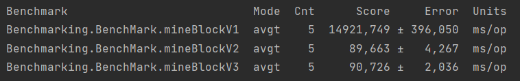

# Java BlockChain API

This is my M.Sc. Exercise and combines multithreading with BlockChain Technology.

### This exercise uses:
* Spring Boot (API)
* Design Patterns (Singleton)
* Multithreading (reduce mining time)
* JMH Benchmarking (for each version)

### Benchmark results
